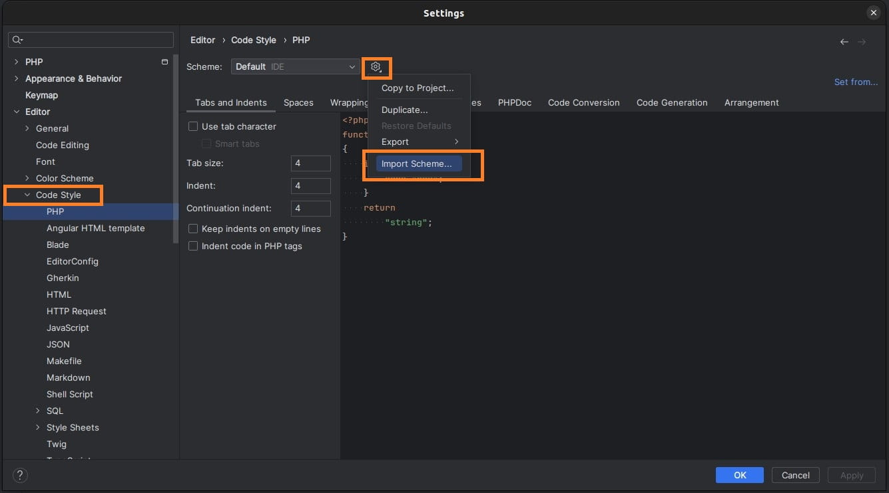
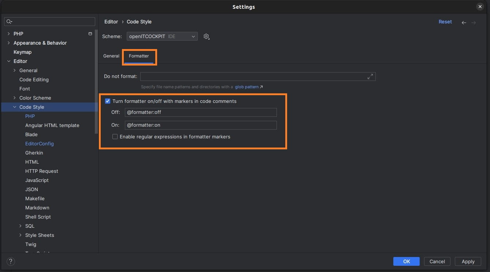
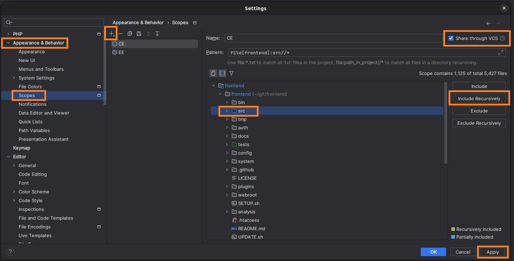
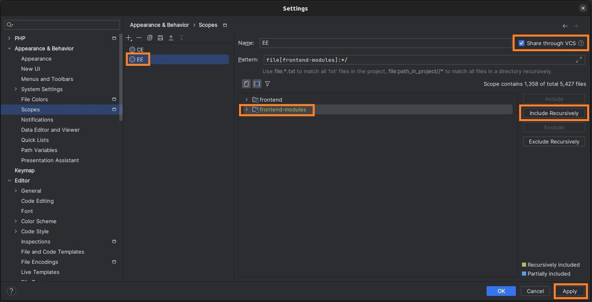
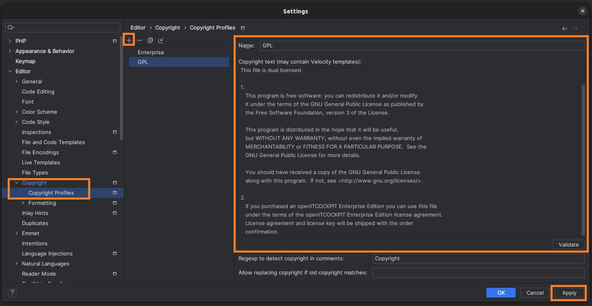
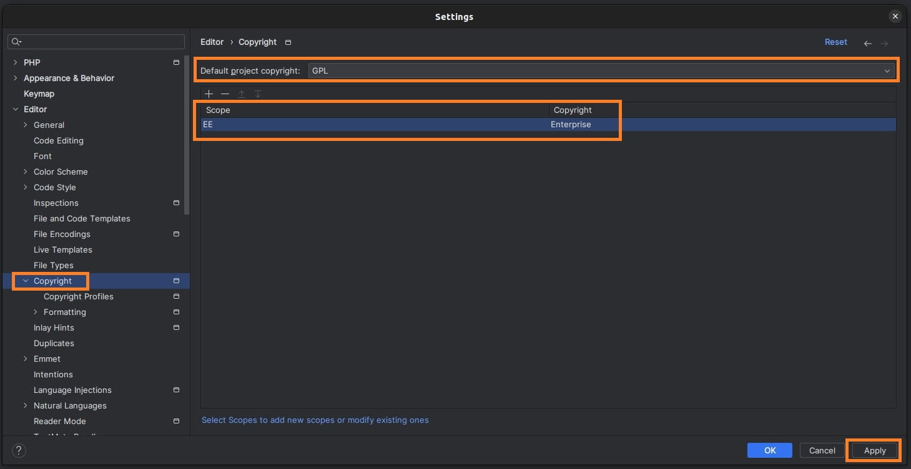
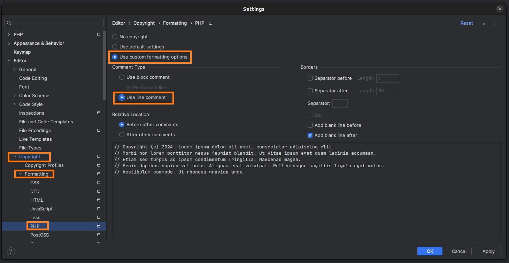
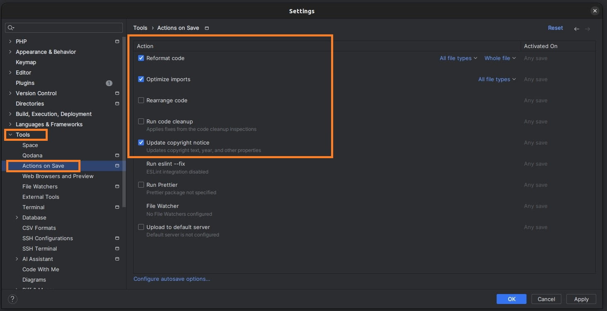

# Codestyle for openITCOCKPIT

This document describes how to set up PhpStorm, to develop for openITCOCKPIT.

- PhpStorm: [openITCOCKPIT.xml](openITCOCKPIT.xml)
- Generic Editor: [.editorconfig](.editorconfig)

### Load Code Style for PHP, JavaScript and TypeScript files

Go to `Editor` ▶ `Code Style` and select the file `openITCOCKPIT.xml`.

It will contain all required settings for PhpStorm.




Switch to the `Formatter` tab and enable the option `Turn formatter on/off with markers in code comments`.
This option can disable the Code Formatter when required. This gets used within E-Mail templates because some external
systems such as _Znuny_ are parsing E-Mails.



Off value: `@formatter:off`

On value: `@formatter:on`

### CE and EE Scopes
openITCOCKPIT is dual licensed under the terms of GPL 3 or proprietary. PhpStorm can automatically apply the corosponding
copyright header using scopes.

Go to `Appearance & Behavior` ▶ `Scopes` and create a new `Shared Scope` called `CE`.
This Scope will be the default scope and will be licensed unter the GPL.

Select the `frontend/src` folder recursively and press on `Apply`.

> ❗ It is important to only select the `frontend/src` folder !



In the next step create a new `Shared Scope` called `EE` - for the Enterprise Edition.

Select the complete `frontend-modules` folder recursively and press on `Apply`.



> ❗ Make sure that `Share through VCS` is ticked for both scopes

### Create Copyright

Go to `Editor` ▶ `Copyright` ▶ `Copyright Profiles` and create a new profile `GPL`.
Insert the following license information



```
Copyright (C) <2015>  <it-novum GmbH>

This file is dual licensed

1.
    This program is free software: you can redistribute it and/or modify
    it under the terms of the GNU General Public License as published by
    the Free Software Foundation, version 3 of the License.

    This program is distributed in the hope that it will be useful,
    but WITHOUT ANY WARRANTY; without even the implied warranty of
    MERCHANTABILITY or FITNESS FOR A PARTICULAR PURPOSE.  See the
    GNU General Public License for more details.

    You should have received a copy of the GNU General Public License
    along with this program.  If not, see <http://www.gnu.org/licenses/>.

2.
    If you purchased an openITCOCKPIT Enterprise Edition you can use this file
    under the terms of the openITCOCKPIT Enterprise Edition license agreement.
    License agreement and license key will be shipped with the order
    confirmation.
```

Create a second profile `Enterprise` with this license information
```
Copyright (C) <2015-present>  <it-novum GmbH>

This file is licensed under the terms of the openITCOCKPIT Enterprise Edition license agreement.
The license agreement and license key were sent with the order confirmation.
```

### Apply Copyright

Go to `Editor` ▶ `Copyright` and select the `GPL` as default project copyright.

Click on the `+` to create a new overwrite for the `EE` scope, to use our proprietary license.

Select `EE` as Scope and `Enterprise` as Copyright.

> ℹ If the `EE` Scope is not in the list, make sure that you are using a `Shared Scope`. 
> 


#### Legacy Format
For legacy reasons navigate to `Editor` ▶ `Copyright` ▶ `Formatting` ▶ `PHP`
and select `Use custom formatting options` and `Use line comment`




### Actions on Save

PhpStorm can automatically apply all formatting, and copyright takes when saving a file.

Go to `Tools` ▶ `Actions on Save` and pick

- `Reformat code`
- `Optimize imports`
- `Update copyright notice`




# Please update

If you have any suggestions to improve our default Code style or if you want to a new Filetype (`.json` for example)
than please create a Pul Request

